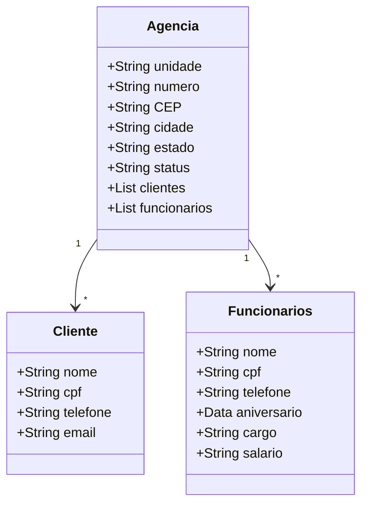

## ✅💳 BEM VINDO(A) AO SEU GERENCIAMENTO DE AGÊNCIAS!
A seguinte aplicação visa gerenciar agências de um banco, trazendo também informaçôes de funcionários e clientes associados. Podemos verificar o status, numero e endereço de cada agência, bem como a quantidade de funcionarios e clientes por agencia, além de outros atributos inerentes a essas duas classes.

## 💻 Tecnologias utilizadas para o desenvolvimento da aplicação :

 

  

## Modelagem do sistema ⬇️
  

## 📱 Desenvolvimento:
📄 Camadas:
   
1. Domain:
 - Model: Contém as classes mapeadas em entidades no banco de dados, incluindo Agencia, Clientes e Funcionários.
 - Repository: Responsável pela interação com a camada de persistência de dados, realizando o acesso ao banco de dados e detendo métodos consulta personalizados. 
2. DTO (Data Transfer Object): Encapsula e estrutura as informações que serão enviadas ou recebidas pelos endpoints sem expor as entidades, garantindo uma melhor organização e segurança da API.
3. Mappper: Mapeamento de entidade pra DTO e DTO pra entidade usando o mapstruct;
4. Service:
 - Service: Inteface com os métodos que serão implementados pela camada de negócios, que foram: findById/numero (no caso da Agencia), findALL, create, update e delete.
 - ServiceImpl: Responsável pela lógica de negócio da aplicação.   
5. Controller: Controladores REST que mapeiam os endpoints para as operações CRUD definidas e manipulam as requisições HTTP.
6. Config: Configuração do swagger open ai;
7. Exception: mplementação de um manipulador global de exceções (GlobalExceptionHandler) para lidar com exceções comuns, como NoSuchElementException e IllegalArgumentException, e retornar mensagens apropriadas ao cliente.

## Imagens da aplicação:
 
 
 
 

 ## 🚀 Deploy da API pelo Railway
https://decola-tech-api-desafio-2025-production.up.railway.app/swagger-ui/index.html#/
