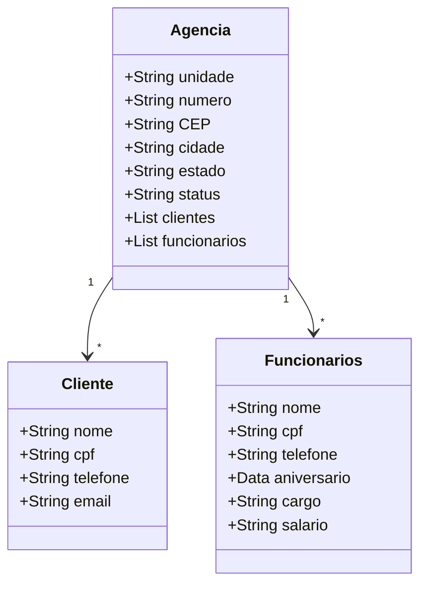

## BEM VINDO AO SEU GERENCIAMENTO DE AGÊNCIAS BANCÁRIAS!
A seguinte aplicação visa gerenciar agências de um banco, trazendo também informaçôes de funcionários e clientes associados. Podemos verificar o status, numero e endereço de cada agência, bem como a quantidade de funcionarios e clientes por agencia, além de outros atributos inerentes a essas duas classes.

## Tecnologias Utilizadas:

 

  

## Entidades trabalhadas no projeto:

## Desenvolvimento da API:

1. Estrutura:

 - Model: Contém as entidades do banco de dados, incluindo Agencia, Clientes e Conta.
 - DTO (Data Transfer Object): Encapsula e estrutura as informações que serão enviadas ou recebidas, garantindo uma melhor organização e separação de preocupações.
 - Repository: Responsável pela interação com a camada de persistência de dados, gerenciando a comunicação com o banco de dados.
 - Service: Responsável pela lógica de negócio da aplicação. Ela atua como intermediária entre o Controller e o Repository.
 - Controller: Controladores REST que mapeiam os endpoints para as operações CRUD e manipulam as requisições HTTP.
 - Config: Configuração do swagger open ai

2. Operações CRUD:

 - Create: Permite criar novas contas, clientes e funcionários com base nas regras de négocio estabelecidas
 - Read: Permite buscar a agência pelo número da mesma, funcionários e clientes pelo id. Também permite listar todas as agências, clientes e funcionários.
 - Update: Permite atualizar as informações específicas das entidades, como status da agencia, salário e cargo dos funcionários, e algumas informações dos clientes.
 - Delete: Permite deletar um usuário do sistema.
 
4. Tratamento de Exceções:

 Implementação de um manipulador global de exceções (GlobalExceptionHandler) para lidar com exceções comuns, como NoSuchElementException e IllegalArgumentException, e retornar mensagens apropriadas ao cliente.

## Imagens da aplicação:
 
 
 
 

 ## Deploy da API pelo Railway
https://decola-tech-api-desafio-2025-production.up.railway.app/swagger-ui/index.html#/
