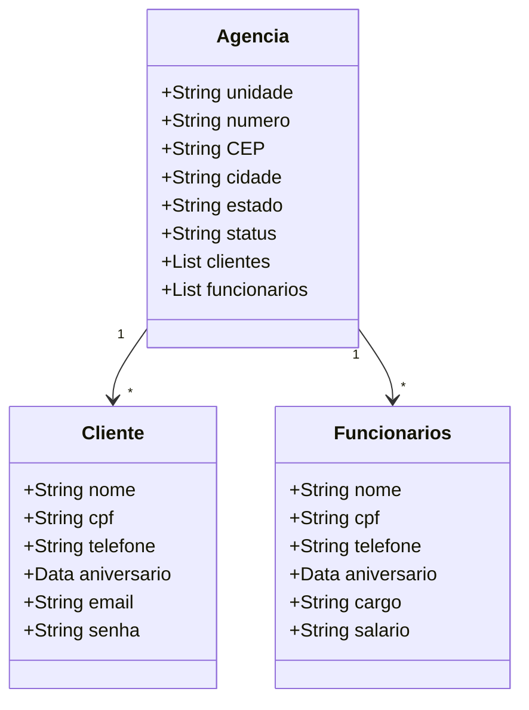

## API REST com Java, Spring Boot 3, Maven, PostgreSQL e Railway ☕
O seguinte projeto teve como objetivo desenvolver uma API RESTful com contexto bancário, utilizando boas práticas de programação, usando Java com Spring Boot para gerenciar usuários, contas bancárias, cartões de crédito, transações, histórico de compras e endereço do usuário.

## Tecnologias Utilizadas:

 

  

## Entidades criadas para o projeto:

## Desenvolvimento da API:

1. Estrutura:

 Entity: Contém as entidades do banco de dados, incluindo User, Account, Card, Transactions, Purchases e Address.
 DTO (Data Transfer Object): Encapsula e estrutura as informações que serão enviadas ou recebidas, garantindo uma melhor organização e separação de preocupações.
 Repository: Responsável pela interação com a camada de persistência de dados, gerenciando a comunicação com o banco de dados.
 Service: Responsável pela lógica de negócio da aplicação. Ela atua como intermediária entre o Controller e o Repository.
 Controller: Controladores REST que mapeiam os endpoints para as operações CRUD e manipulam as requisições HTTP.

2. Operações CRUD:

 Create: Permite criar novos usuários no sistema com suas respectivas contas, cartões, funcionalidades e notícias.
 Read: Permite buscar usuários por ID e listar todos os usuários cadastrados.
 Update: Permite atualizar as informações de um usuário existente.
 Delete: Permite deletar um usuário do sistema.
 
4. Tratamento de Exceções:

 Implementação de um manipulador global de exceções (GlobalExceptionHandler) para lidar com exceções comuns, como NoSuchElementException e IllegalArgumentException, e retornar mensagens apropriadas ao cliente.

## Imagens da aplicação:
 
 
 
 
 

 ## Documentação da API (Swagger)
https://decola-tech-api-desafio-2025-production.up.railway.app/swagger-ui/index.html#/
